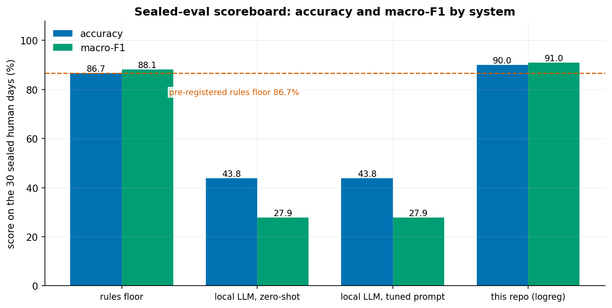
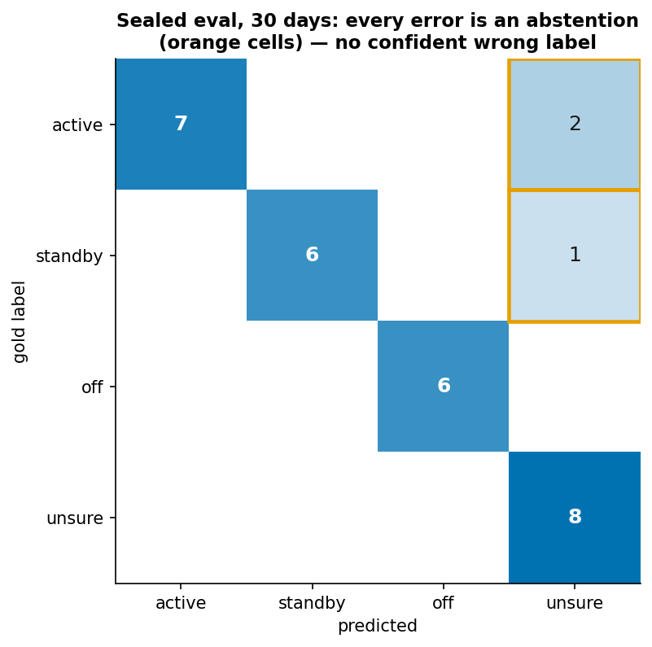
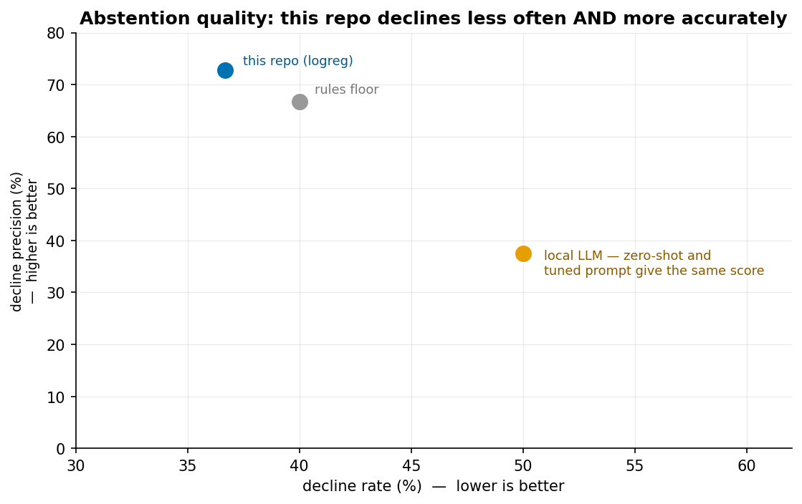
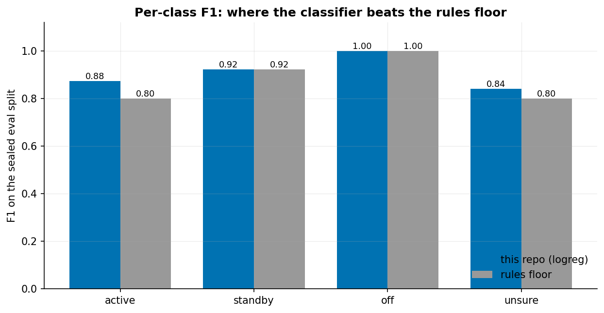
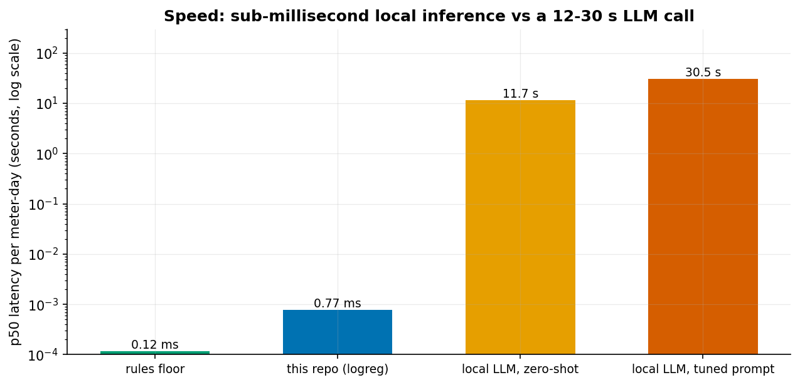
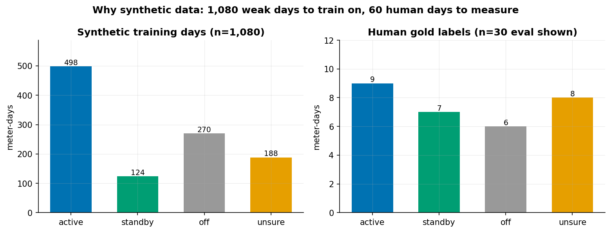

# meter-day-classifier

Reads a machine's electricity meter (one reading every 15 minutes) and
says, for each day, whether the machine was **running**, **idling on
standby**, **off**, or whether the data is too unclear to say. It uses a
small classic statistical model, runs on a laptop with no internet, and
makes no calls to an AI service.

Headline result: **90.0% correct on a sealed 30-day test, against 86.7%
for a hand-written rule**, at 0.77 milliseconds per day and no per-use
cost. Section 6 explains how small that gap really is.

Self-contained: the data format, loader, scorer, and synthetic-data
generator all live in this repo. The only thing not shipped is the 60
hand-labeled days (private, see `data/README.md`).

Keywords: energy analytics, meter data, classification, offline,
reproducibility, scikit-learn.

## 1. The problem

Industrial sites collect months of 15-minute electricity data for each
sub-meter. The question that matters is simple: _was this machine running,
idling in standby, or off, and on which days should someone look closer?_
Today that is still answered by eyeballing charts, or by one-off threshold
scripts that nobody can compare or audit. The waste is concrete: a
compressor humming through the night, a production line left in standby
over the weekend, an idle load nobody noticed because the daily total
looked normal.

Standby consumption is a recurring, hidden source of energy waste, and
detecting it reliably is harder than it looks. Real meter data is messy
(missing readings, oddities, machines that do not behave as expected), so
"no reliable answer for this meter, and here is why" has to count as a
proper answer, not a failure. A classifier that silently guesses on a bad
day is worse than one that declines.

What about a cloud AI service (a "large language model", or LLM, the kind
of tool behind chatbots)? Sending customer consumption data to a third
party raises data-protection obligations. Per-token bills (AI services
charge by the amount of text processed) make scoring every day of every
meter uneconomic at scale. And free-text AI answers are hard to audit line
by line. So this project does the same job with a small, predictable,
fully offline model: one defensible state per meter-day, an explicit "not
sure" when the evidence is thin, and a one-line reason citing the numbers
behind the call.

For the commercial framing (buyers, return on investment, engagement
shapes) see [`docs/SOLUTION.md`](docs/SOLUTION.md).

## 2. What it does

**Comes in:** one meter's readings, a timestamp and a kilowatt-hour value
every 15 minutes.

**Goes out:** one label per day, plus a one-line reason.

| Label     | Meaning                                                              |
| --------- | -------------------------------------------------------------------- |
| `active`  | The machine ran at working load for a meaningful part of the day.    |
| `standby` | The machine drew a low, steady load, like a screen left on overnight. |
| `off`     | The machine drew close to nothing.                                   |
| `unsure`  | The data is too thin, too flat, or too borderline to call honestly.  |

The reason cites the numbers behind the call, measured against that
meter's own normal level. Days marked `unsure` are the ones to queue for a
person to review.

## 3. How it works

The label is statistics, the reason is language. The two are kept apart.

**The label** comes from a small statistical model called logistic
regression. It looks at 26 numbers computed from each day (for example,
how much of the day the meter sat near zero, or how high the busiest
hours ran compared with the quietest), and picks the most likely label. It
is a few kilobytes in size and gives the same answer every time for the
same input.

**The reason** is a fill-in-the-blanks sentence that quotes those numbers.
It is never scored as a prediction, and no text generator is involved.

Training happens in three steps:

1. **Pretrain on rule-labeled examples.** 1,080 synthetic (computer-made)
   meter-days carry labels produced by a fixed rule, called _weak labels_
   because a rule wrote them, not a person (`synth/`). The model learns
   the 26 numbers per day. A 5-fold cross-check (the data is split into
   five parts and the model is tested on each part in turn) scores 0.9919
   macro-F1 on those weak labels. Macro-F1 is a score from 0 to 1 that
   averages how well each label is predicted, so a model cannot look good
   by only ever guessing the most common label. That score is the model
   copying the rule, not a success claim.
2. **Set the "not sure" threshold on 30 human-labeled days.** `unsure` is
   a real output. The cutoff froze at t=0.0 (the model simply picks its
   most likely label), with 11 of 11 declines correct and no declines that
   a person could have labeled.
3. **Test once on 30 sealed human-labeled days.** One run, recorded in
   Section 5. "Sealed" means the model never saw these days and they were
   used only for this one measurement.

**Pipeline at a glance.** Data flows left to right; each arrow is one
command:

```text
generate_synth_meters.py → synth/            weak-labeled meter-days
        features.py      → 1080 × 26 matrix  features only, no model
        train.py         → artifacts/        CV winner, then refit
        predict.py       ← artifacts/        loads frozen model, read-only
        run_eval.py      → outputs/          frozen scorer, sealed split
        make_figures.py  ← outputs/ + synth/  the README figures
```

`rules_floor.py` sits beside this as the hand-written rule the model is
measured against (the "rules floor", the score any learned model has to
beat to justify existing). `scorer.py` holds the metrics both use.

### Synthetic training data

Thirty hand-labeled days cannot teach a model 26 numbers per day: picking
between candidate models on 30 rows is noise. Human labels are capped at
60, so volume comes from weak (rule-generated) labels instead.

**Generator (`generate_synth_meters.py`, standard library + numpy, pinned
seeds).** It mimics the meter file shape only: 15-minute
`timestamp,value_kwh` rows grouped into meter-days. No real consumption
data is reused; every level is drawn from fixed synthetic ranges, so
reruns are byte-identical (checked against a fingerprint of the shipped
files). Scale: 12 meters × 90 days × 96 intervals = **103,632 interval
rows** with **1,080 day labels**. The meter mix is weighted toward
standby and off (5 night-standby, 3 mostly-off, 2 weekend-line, 2 mixed)
so the label mix stays trainable; the spring-forward short day
(2026-03-29, 92 intervals) is covered.

#### How a synthetic meter is built

Each meter is a fixed calendar plus a small state machine, drawn
deterministically from a per-meter seed (`38000 + meter_index`, so the
whole set regenerates byte-identically):

1. **Calendar.** Fixed start (2026-01-05), 15-minute stamps with
   daylight-saving offsets; the spring-forward day is generated with its
   real 92 intervals so the short-day path is exercised.
2. **Archetype and parameters.** Each meter gets one of four behavior
   archetypes and draws its parameters from fixed ranges: running level
   (log-uniform 0.4–400 kW), run noise, floor ratio (the standby level as
   a share of the running level), idle/zero probabilities, missing rate.
   - _night_standby_: runs weekday 07–17, sits on a low floor overnight
     and on weekends, with occasional zeros.
   - _mostly_off_: mostly zero with 1–3 random run blocks per day
     (~62–70% zeros overall).
   - _weekend_line_: runs at night (19–05) and partly by day on
     weekdays, floor on weekends.
   - _mixed_: floor all day with 2–3 random run or floor blocks.
3. **Values.** Each state's level is converted to 15-minute kWh (level ÷
   4, since a level is a kW draw over a quarter hour) with multiplicative
   Gaussian noise (random jitter scaled to the level); a separate noise
   sigma applies to always-on meters.
4. **Disturbances.** Weekly spike bursts (0–3 per week, ×3–10
   multiplier, 1–2 intervals) and missing data: about 30% of missing
   readings placed in contiguous outage blocks of 4–25 intervals, the
   rest scattered, with a per-meter missing rate drawn from 0–15%.
5. **Weak label.** Each day is labeled by the frozen weak-label rule:
   heavy missing (>25% of intervals) → `unsure`; zeros ≥60% of valid
   intervals → `off`; one flat band near the meter's running level →
   `unsure` (flat, no distinction); floor within a third of the running
   level → `unsure` (borderline floor); p95 ≤ 35% of running level →
   `standby` (p95 is the level 95% of readings stay under, a way to
   ignore brief spikes); running share ≥30% → `active`; floor share ≥60%
   → `standby`; else `unsure` (mixed day). The generated mix is 498
   active / 270 off / 188 unsure / 124 standby.

**Weak labels and what they mean.** Weak labels agree with the rules
floor on 97.5% of the 1,080 days. Stated plainly, training here is **rule
distillation** (a model learning to copy a rule): the classifier
approaches the floor but cannot discover beyond it. Its value is a
portable sub-millisecond model with an adjustable "not sure" curve, not
new judgment. The sealed human eval is the only judge that matters.

**How the data is used (three roles, never mixed).**

| Role      | Data                     | Used for                             |
| --------- | ------------------------ | ------------------------------------ |
| FIT       | synth 1,080 weak days    | 5-fold CV, winner pick, refit        |
| CALIBRATE | human train 30 (private) | unsure-threshold operating point     |
| SEALED    | human eval 30 (private)  | one eval run per model, nothing else |

Decontamination (keeping test data out of training) is enforced by
construction: synthetic IDs live in their own `s38_*` namespace, and the
overlap between synthetic and human day IDs is asserted to be 0 whenever
the private labels are present. Without the labels the check is skipped
with a warning.

Regenerate the full set (byte-identical) or a smoke-size one:

```bash
python3 generate_synth_meters.py --root synth
python3 generate_synth_meters.py --root /tmp/smoke --meters 2 --days 5
python3 generate_synth_meters.py --root synth --calibrate --data-root .  # needs private labels
```

### Labelling choices, and what each one costs

Most of the judgment in this project sits in the label design, not the
model. Five decisions did the work, and each one cost something.

| Choice                                                                      | Why it was made                                                                                                           | What it costs                                                                                                                                                       |
| --------------------------------------------------------------------------- | ------------------------------------------------------------------------------------------------------------------------- | ------------------------------------------------------------------------------------------------------------------------------------------------------------------- |
| Four classes, `unsure` kept as a real answer                                | Genuinely ambiguous days exist in the data, and forcing a call on them invents certainty                                  | Accuracy looks worse than a model that always commits. That is deliberate: a wrong confident label is more expensive than an abstention, because someone acts on it |
| Weak (rule) labels for volume, human labels for the verdict                 | Hand labels are capped at 60 and expensive; rules are free and unlimited                                                  | The model inherits the rule's blind spots. It can match the floor, not reason past it. Called out here rather than buried                                           |
| Fit on synthetic, calibrate on human-train-30, evaluate once on a sealed 30 | Keeps human labels as the only honest judge, so the eval number means something                                           | More moving parts and more discipline. One careless look at eval while tuning and the whole measurement is void                                                     |
| 26 engineered features, no raw floats into a model that reads text          | Arithmetic belongs in features. Thresholds, ratios and run lengths are the actual decision boundaries                     | Any pattern the feature set does not encode is invisible to the model                                                                                               |
| Reasons from a template, never scored                                       | The reason is a communication artefact, not a prediction. Scoring it would reward fluent phrasing over correct arithmetic | Reason text is formulaic. It cites the numbers and nothing more                                                                                                     |

The `unsure` decision is the one worth defending hardest, because it is
the least obvious. Two of the four classes are "yes" and "no", one is
"nothing is happening", and the fourth exists because real meter days
regularly fall between them: a machine that idles all weekend at a level
close to its running load is not clearly active and not clearly on
standby. A system without that escape hatch has to guess, and a guess on
a bad day is what erodes trust in the whole set of labels.

### What the labelled days are, and what they are not

The 60 hand-labeled days are ground truth about **a human's reading of the
data**, not about the machine. If two competent engineers disagree on
whether a 30 kW idle band counts as standby or as reduced production, no
model can settle it; that is a definition question the site has to answer.
Labelling surfaces that disagreement early, which is most of its value.

A few habits keep the labels usable:

- **Small and hard beats large and easy.** 60 days chosen for ambiguity
  taught more than a thousand easy ones would have. Days near the decision
  boundary carry the information.
- **Freeze the eval split before fitting anything.** Enforced here rather
  than promised: `train.py` has no code path that loads the eval file.
- **Label blind.** A labeller who sees the model's guess anchors on it, and
  the label stops being independent evidence.
- **Disagreements first.** Where two rules, or a rule and a person, differ
  is where labelling time buys the most.

The same weak-label caveat from above applies to any future expansion: more
rule-generated labels buy a faster model, not a smarter one. If the goal
is new judgment rather than new speed, the answer is more hand labels at
the boundary, and there is no way around that.

## 4. What this teaches you

The lesson here is how a model learns from examples, when it beats a
hand-written rule, and why a system that is allowed to say "I am not sure"
is more trustworthy than one that always answers.

- **A learned model can beat a rule, and the margin can be small.** The
  model scored 90.0% against the rule's 86.7%. That is 27 correct days
  against 26 out of 30. Learn to ask "how many cases is that?" before
  believing a percentage.
- **"Not sure" is a useful answer.** Every one of the model's 3 errors is
  an abstention, never a confident wrong label. In energy work a wrong
  confident label sends someone to act on nothing, or ignore something.
- **A fancier AI tool did not do better.** A local LLM asked the same
  question scored 43.8%, and tuning its prompt changed no quality score
  and only added time. Plausible-looking output and correct output are
  different things, and only a test against human labels tells them
  apart.

## 5. Results

Everything below is scored with the frozen `scorer.py` metrics on the
sealed 30-day human eval split. One run per system, recorded once in
`outputs/results.csv` and `outputs/predictions/*.jsonl`. Six figures, all
generated from the committed numbers by `python3 make_figures.py` (see
[Try it yourself](#7-try-it-yourself)). Nothing here is hand-drawn or
re-run: the script reads `outputs/` and `synth/` only.

**Metrics, in plain English.**

| Metric             | What it means here                                                                                                                                             |
| ------------------ | -------------------------------------------------------------------------------------------------------------------------------------------------------------- |
| Accuracy           | Fraction of the 30 sealed days labeled correctly.                                                                                                              |
| Macro-F1           | Unweighted mean of per-class F1 (a 0 to 1 score per label); punishes a model that wins by predicting only the majority class.                                  |
| Decline rate       | Fraction of days the system answered `unsure` instead of committing.                                                                                           |
| Decline precision  | Of the days the system declined, how many the gold label also marks `unsure` (i.e. genuinely ambiguous). A high decline rate at low precision is just hedging. |
| Schema validity    | Fraction of outputs that parse as a legal `{label, reason}`; 1.0 by construction for this model (one pass, no text generation).                                |
| Consistency        | Repeatability across repeated runs; 1.0 because inference is deterministic (same input, same answer).                                                          |
| p50 latency / cost | Median wall time per day, and cost per 1,000 days. There is no per-token cost because no AI service is called.                                                 |

**Protocol.** The 60 hand-labeled days are frozen 30 train / 30 eval
(`labels_v1.json` + `selection.json`). Synthetic weak days only ever fill
the FIT role; human train days only calibrate the `unsure` threshold; the
eval split is loaded exactly once per model by `run_eval.py` and is never
used for fitting or tuning. `train.py` contains no eval-loading path by
design.

**Accuracy and macro-F1 on the sealed 30-day human eval.** The dashed line
is the pre-registered deterministic rules floor (fixed and recorded before
the model was tested) the model had to beat.



**Frozen human-eval-30 results.**

| System                                       | Accuracy  | Macro-F1  | Decline rate | Decline precision |
| -------------------------------------------- | --------- | --------- | ------------ | ----------------- |
| `rules_floor_v1` (deterministic floor)       | 86.7%     | 0.881     | 40.0%        | 0.667             |
| `llm_zero_shot_v1` (local 2B LLM)            | 43.8%     | 0.279     | 50.0%        | 0.375             |
| `llm_prompt_opt_v1` (same LLM, tuned prompt) | 43.8%     | 0.279     | 50.0%        | 0.375             |
| `classical_logreg_v1` (this repo)            | **90.0%** | **0.910** | 36.7%        | **0.727**         |

The two `llm_*` rows are reference baselines kept for context: an
off-the-shelf local LLM asked the same four-label question, once
zero-shot (no examples, no tuning) and once with a tuned prompt. They
score **identically on every quality metric**. The tuned prompt bought no
accuracy, only extra latency (11.7 s vs 30.5 s per day). They are not this
repo's method; this repo's row is `classical_logreg_v1`.

`classical_logreg_v1`: validity 1.0, consistency 1.0 (deterministic),
per-class 7/9 active, 6/7 standby, 6/6 off, 8/8 unsure. All 3 errors are
over-abstentions (never a confident wrong label). A rules-first hybrid
variant was evaluated and removed: it predicted identically to the pure
classifier on all 30 eval days, so only the simpler model ships.

**Every error is an abstention, never a confident mistake.** Cells are
gold × predicted counts; orange rings mark the only off-diagonal entries.
All three are `unsure` calls, and every gold-`unsure` day is caught (8/8).



**Abstention quality.** Up and to the left is better: the model declines
less often _and_ more accurately than the floor, and far more usefully
than the LLM baselines.



**Per-class F1.** The model beats the floor on `active` and `unsure`, the
two classes that matter for triage, and ties it on `standby` and `off`.



**Speed.** Local inference (0.77 ms per meter-day) is roughly four orders
of magnitude faster than asking an LLM (11.7 s), with no tokens and no
server.



**Why there is synthetic data at all.** 30 training rows cannot fit 26
features, so volume comes from rule-generated weak labels over generated
meters; the 60 human days are kept for fitting the abstention threshold
and for the one sealed measurement.



## 6. Where it fails

**What the numbers do and don't show.** They show a deterministic,
offline model that beats a hand-written rules floor on a sealed
human-labeled split while declining less often and more precisely. They
do not show production readiness or real-world accuracy: training labels
are weak (rule-generated) and the 60 gold days are a small, private set
from one synthetic benchmark. The eval is a controlled comparison, not a
savings claim.

Specific limits, stated plainly:

- **The win over the rule is one day.** 90.0% is 27 of 30 days correct
  and the 86.7% floor is 26 of 30. With 30 test days, a 3.3-point gap is
  within what a single relabeled day could erase. Read it as "at least as
  good as the rule, with a tunable abstention curve", not "clearly better".
- **The model cannot see past the rule that trained it.** It learned from
  labels the rule wrote (97.5% agreement with the floor on the training
  days). It can match the floor, not reason beyond it.
- **It declines a lot.** 11 of 30 days (36.7%) went to `unsure`. 8 of
  those were genuinely ambiguous by the human labels; 3 were days a person
  did label. The model's 7/9 recall on `active` means two running days
  were sent to review instead of called.
- **Nothing is a confident mistake here, on these 30 days.** That is a
  result on a small set, not a guarantee.
- **The test days are private and from one synthetic benchmark.** You can
  rebuild the training data and figures with no private data, but the
  published 90.0% row needs the 60 private labels to re-run from scratch.
  Without them, the shipped model and prediction files reproduce the
  number as-is.
- **The labels are one person's reading.** Two engineers could disagree on
  where standby ends and reduced production begins. No model settles that.

**Two floor numbers in one file, and why.** `outputs/results.csv` holds
two rows for the rules floor because the floor was scored on both human
splits: **93.3% on the 30 training days** (the days used to set the
"not sure" cutoff) and **86.7% on the 30 sealed eval days**. The headline
comparison uses the eval row, 86.7%, because the eval split is the only
one the model is judged on. The 93.3% belongs to the training split and
should not be compared with the model's 90.0%.

## 7. Try it yourself

**What you need.** Python 3.10+. No GPU and no network. `matplotlib` is
only needed to rebuild the figures; the runtime requirements stay free of
it on purpose.

```bash
pip install -r requirements.txt           # runtime: numpy, scikit-learn==1.4.0
pip install -r requirements-figures.txt   # only to rebuild README figures
```

**Reproduce (no private data needed).**

```bash
./reproduce.sh   # compile check, weak-matrix build, CV, smoke generation + inference
```

Or step by step:

```bash
python3 generate_synth_meters.py --root synth --meters 2 --days 5  # tiny regen smoke test
python3 features.py --build-synth    # 1080-row weak matrix check
python3 train.py --variant synth     # CV on weak labels (artifacts need private labels)
python3 make_figures.py              # rebuild docs/figures/ from outputs/ + synth/
```

`make_figures.py` needs `matplotlib`, which is **not** a pipeline
dependency. It ships as a separate, self-contained requirements file:

```bash
pip install -r requirements-figures.txt   # requirements.txt + matplotlib
python3 make_figures.py                  # rebuild docs/figures/
```

It reads only committed files, so it works without the private labels and
cannot drift from the scoreboard.

Regenerating the full `synth/` (12 × 90) is byte-identical to the shipped
files (checked against a fingerprint). Steps needing the private human
labels (`--check-splits`, threshold calibration inside `train.py`,
`--calibrate`, `run_eval.py`) fail with a clean pointer to
`data/README.md` when the labels are absent. With the labels placed, the
published 90.0% row reproduces from the shipped `artifacts/` model.

**What each step writes** (so you can tell a rerun from a rewrite):

| Command                                 | Writes                                     |
| --------------------------------------- | ------------------------------------------ |
| `generate_synth_meters.py --root synth` | `synth/` (overwrites, byte-identical)      |
| `features.py --build-synth`             | nothing (prints the matrix shape)          |
| `train.py --variant synth`              | `artifacts/` (overwrites the frozen model) |
| `run_eval.py`                           | `outputs/` (appends the scoreboard row)    |
| `make_figures.py`                       | `docs/figures/*.png` (overwrites figures)  |

### Repo map

```text
meter-day-classifier/
├── synth/                  generated training data  (committed, regenerable)
│   ├── data/raw/s38_m*.csv   12 meter CSVs, 15-min intervals
│   ├── labels_synth38_v1.json  1,080 weak day labels
│   ├── generator_stats.csv   per-meter summary
│   └── README.md
├── artifacts/              the frozen trained model  (committed)
│   ├── model.joblib          logistic regression
│   └── operating_point.json  threshold + feature medians
├── outputs/                the measured results  (committed)
│   ├── results.csv           scoreboard, one row per system per split
│   └── predictions/          per-day labels + reasons (.jsonl)
├── data/                   private gold labels  (NOT committed)
│   └── README.md             what to place here
├── docs/
│   ├── SOLUTION.md         business framing: buyers, ROI, engagement
│   └── figures/            the six README figures (.png)
├── <pipeline>.py           see "File reference" below
├── make_figures.py         rebuilds docs/figures/ from the committed numbers
├── reproduce.sh            one-command public run
├── requirements.txt        runtime: numpy, scikit-learn==1.4.0
├── requirements-figures.txt  extra: matplotlib (for make_figures.py only)
└── LICENSE / NOTICE        Apache-2.0 + attribution
```

Four folders, four jobs. Every folder name says which one:

| Folder       | Committed?                            | Contains                                                             | Regenerate with                                           |
| ------------ | ------------------------------------- | -------------------------------------------------------------------- | --------------------------------------------------------- |
| `synth/`     | yes (generated, ~3.4 MB)              | Synthetic training data: 12 meter CSVs, weak labels, generator stats | `python3 generate_synth_meters.py --root synth`           |
| `artifacts/` | yes (frozen model, ~10 KB)            | The trained model and its operating point                            | `python3 train.py --variant synth` (needs private labels) |
| `data/`      | **no**, `README.md` placeholder only  | The private 60 hand-labeled gold days                                | you place them; see `data/README.md`                      |
| `outputs/`   | yes (the frozen numbers)              | Scoreboard `results.csv` + per-day predictions `.jsonl`              | `python3 run_eval.py` (needs private labels)              |
| `docs/`      | yes                                   | Business framing only (`SOLUTION.md`)                                | n/a                                                       |

**Why data and model live in separate folders.** They have different
lifetimes and different permissions: `synth/` is _input_ (regenerable any
time, byte-identical), `artifacts/` is a _frozen output_ of training that
must not be overwritten by accident, and `data/` is _private_ (never
committed). Keeping the model out of `synth/` means "delete and regenerate
the data" can never silently delete the shipped model.

### File reference

The repo map above shows the folders. This is the file-by-file detail, in
the order data flows through the pipeline:

| Path                       | Role                                                                                             |
| -------------------------- | ------------------------------------------------------------------------------------------------ |
| **1. Generate data**       |                                                                                                  |
| `generate_synth_meters.py` | Pinned-seed synthetic meter generator (stdlib + numpy); writes `synth/`                          |
| **2. Build features**      |                                                                                                  |
| `evidence.py`              | Day-evidence contract (`DayEvidence`, day grouping, p95 reference)                               |
| `data_io.py`               | Loader (`DayRecord`, label/split loading)                                                        |
| `features.py`              | Closed 26-feature contract from `DayEvidence` only; `--check-splits`, `--build-synth`            |
| **3. Train**               |                                                                                                  |
| `train.py`                 | Weak-label CV + human-train calibration; writes `artifacts/`; has no eval-loading path by design |
| `artifacts/`               | Frozen model (`model.joblib`) + operating point (`operating_point.json`)                         |
| **4. Predict**             |                                                                                                  |
| `predict.py`               | Frozen-model predictor + template reason; reads `artifacts/` read-only                           |
| **5. Evaluate**            |                                                                                                  |
| `rules_floor.py`           | Deterministic floor; the reference the model is measured against                                 |
| `scorer.py`                | Metrics + run harness used by both                                                               |
| `run_eval.py`              | Eval-once via the scorer; writes to `outputs/` only                                              |
| **Data folders**           |                                                                                                  |
| `synth/`                   | Generated training data + weak labels (regenerable)                                              |
| `data/`                    | Placeholder; private human labels live here locally, never in git                                |
| `outputs/`                 | Scoreboard (`results.csv`) + per-day predictions (`.jsonl`)                                      |
| **Docs / run / license**   |                                                                                                  |
| `docs/SOLUTION.md`         | Business framing: buyers, ROI, engagement shapes                                                 |
| `reproduce.sh`             | One-command public run (no private data needed)                                                  |
| `make_figures.py`          | Rebuilds `docs/figures/*.png` from the committed numbers (needs `matplotlib`)                    |
| `docs/figures/`            | The six README figures                                                                           |
| `requirements.txt`         | Runtime deps: `numpy`, `scikit-learn==1.4.0`                                                     |
| `requirements-figures.txt` | Figure deps: `matplotlib`, includes the runtime deps                                             |
| `LICENSE` / `NOTICE`       | Apache-2.0 + attribution notices                                                                 |

## 8. Privacy and cost

- **Nothing leaves the machine.** Training and prediction need no network,
  no cloud account, and no model server. Meter readings are never sent to a
  third party, so there is no data-protection addendum to negotiate.
- **No per-use cost.** No tokens are used. Predicting one day takes about
  0.77 ms on a normal CPU (median, measured in `outputs/results.csv`).
- **Private data stays private.** The 60 hand-labeled days are excluded
  from git (`.gitignore`) and never shipped. The synthetic data contains no
  real consumption records.

## 9. Links

- Repo: [TMFNK/meter-day-classifier](https://github.com/TMFNK/meter-day-classifier)
- Commercial framing: [`docs/SOLUTION.md`](docs/SOLUTION.md)
- Sibling project: [TMFNK/meter-mcp-server](https://github.com/TMFNK/meter-mcp-server), which exposes this classifier as a tool an AI assistant can call
- License: Apache-2.0, copyright 2026 MbitAI. See `LICENSE` and `NOTICE`.

Need this applied to your own meters? Email info@mbitai.com.
